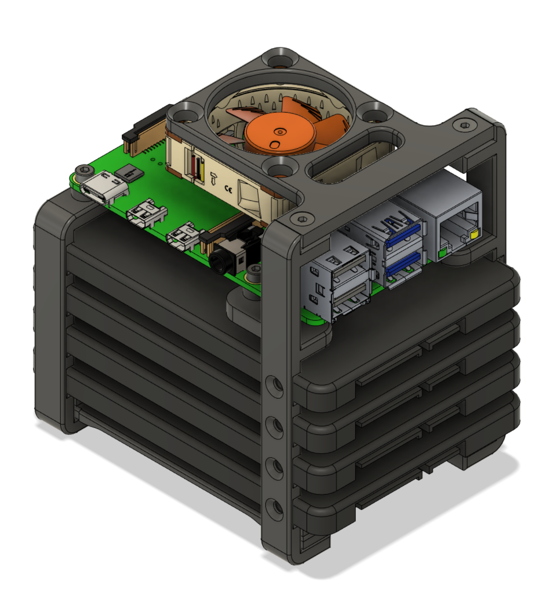

# Raspberry Pi NAS Rack for up to 4 2.5"-SSDs

## Highlights
- **Slim**: The rack is only 4mm wider than a 2.5" SSD and as long as a 2.5" SSD
- **Modular**: 2-bay and 4-bay version available, each with or without fan mount
- **Accessible**: All Raspberry Pi ports/pins are accessible without the fan
- **Ease-Of-Use**: Small nobs secure the SSDs without screws for quick swapping
- **Open-Source**: STEP-File with complete assembly available for easy modding

## Sourcing / BOM
Please refer to the [BOM file](./Sourcing/BOM.xlsx)

## Printing

At least 100mm x 100mm buildplate size is required.

Depending on what version of the NAS rack you want, you need to print different parts:
|Part Name|2-Bay|2-Bay with fan|4-Bay|4-Bay with fan|Support needed|
|---|---|---|---|---|---|
|40mm_fan_mount.stl| |1| |1|No|
|brace_long_side.stl|2|2|2|2|No|
|brace_short_side.stl|2|2|2|2|No|
|column_noshift_noscrew.stl|2|2| | |Touching Buildplate|
|column_noshift_noscrew_QUAD.stl| | |2|2|Touching Buildplate|
|column_shift.stl|1| | | |Touching Buildplate|
|column_shift_mirror.stl|1| | | |Touching Buildplate|
|column_shift_fan.stl| |1| | |Touching Buildplate|
|column_shift_fan_mirror.stl| |1| | |Touching Buildplate|
|column_shift_QUAD.stl| | |1| |Touching Buildplate|
|column_shift_QUAD_mirror.stl| | |1| |Touching Buildplate|
|column_shift_fan_QUAD.stl| | | |1|Touching Buildplate|
|column_shift_fan_QUAD_mirror.stl| | | |1|Touching Buildplate|

These are only recommendations and worked fine on my Ender 3:
|Settings|Value|
|---|---|
|Wall count|4|
|Top/Bottom Layers|4|
|Layer Height|0.2mm|
|Material|PLA|
|Infill|40%|
|Support|Refer to table above|

## Important Notes
When using multiple SSDs, make sure that the accumulated current draw across all USB ports do not surpass the maximum rated output. Also make sure that your power supply can handle the additional power requirements.
|RPi Model|Maximum rated output across all ports|
|---|---|
|Pi 2,3,4|1200mA|

Also consider the shared bandwith of the USB ports.

## CAD Credits
The 3D-models for the Screws, Nuts, SSDs, Raspberry and Fan are from GrabCAD:

|Model|Author|Link|
|---|---|---|
|M3x10 Screw|[Antonio Ghio](https://grabcad.com/antonio.ghio-1)|[Source](https://grabcad.com/library/hex-socket-countersunk-flat-head-screws-m3-1)|
|M3 Nut|[ioan skurka](https://grabcad.com/ioan.skurka-1)|[Source](https://grabcad.com/library/all-m3-sh-standard-screws-m3-hex-nut-and-flat-washer-for-m3-screw-1)|
|M2.5x10 Screw|[VIVEK AKASH](https://grabcad.com/vivek.akash-2)|[Source](https://grabcad.com/library/m2-5-0-45-hex-screw-5-10-15-20-25-30-mm-1)|
|M2.5 Nut|[Antonio Ghio](https://grabcad.com/antonio.ghio-1)|[Source](https://grabcad.com/library/nuts-and-washers-m2-5-1)|
|2.5" SSD|[Thin Pinstripes](https://grabcad.com/thin.pinstripes-1)|[Source](https://grabcad.com/library/u2-2-5in-ssd-1)|
|NF-A4x10 FLX|[Gerard](https://grabcad.com/gerard-84)|[Source](https://grabcad.com/library/noctua-fan-nf-a4x10-flx-4010-1)|
|Raspberry Pi 4 Model B|[Hasanain Shuja](https://grabcad.com/hasanain.shuja-1)|[Source](https://grabcad.com/library/raspberry-pi-4-model-b-1)|

## References
[1]: Rasberry Pi Documentation, [Link](https://www.raspberrypi.com/documentation/computers/raspberry-pi.html#universal-serial-bus-usb)
